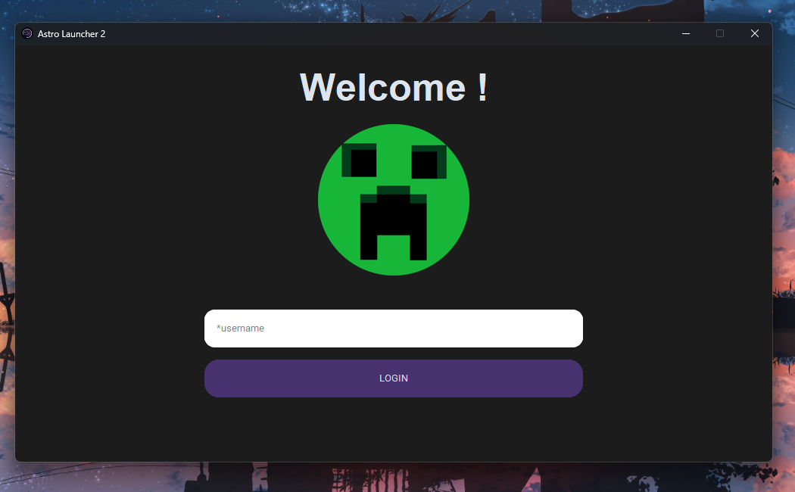
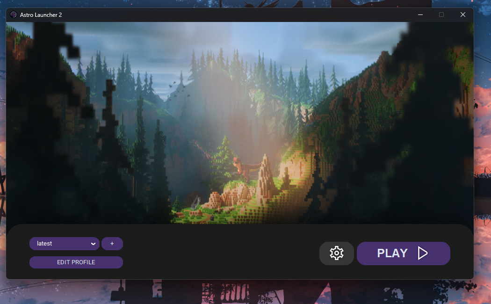
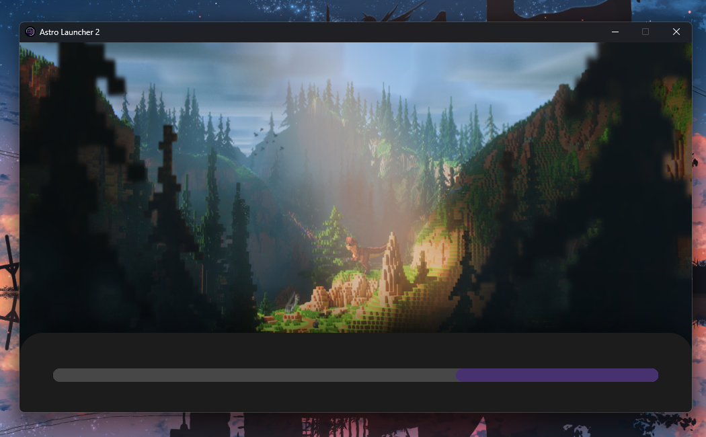
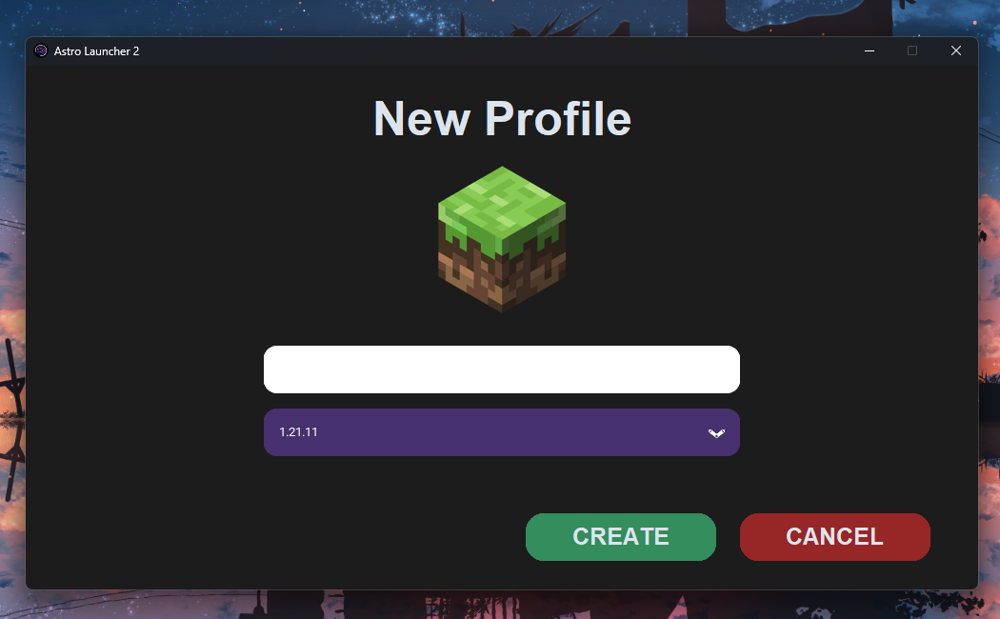
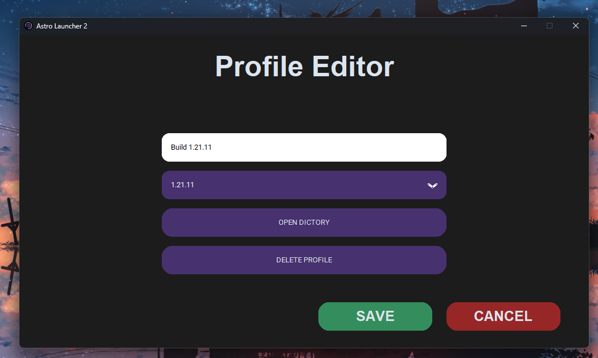

## 🪐 Astro Launcher 2
</img>

## Overview
My ultimate minecraft launcher, made using python.
You can use it to play any version of Minecraft with separed game files for each profiles.

### Objectives

| Functionality | Implementation |
| :--- | :--- |
| **GUI** | ✅ |
| **Profiles files separation** | ✅ |
| **Offline Login** | ✅ |
| **Customizable settings** | ❌ |

### Login page
</img>
### Main Page
</img>
### Loading animation
</img>
### Settings page
/!\ SOON /!\
### Profile Managment pages
</img>
</img>

## ⚙️ Installation
To execute this app, you only need to download the last release in the dedicated section, next, extract the zip file and create a shortcut were you want the "AstroLauncher 2.exe" file to be.

## 🚀 Usage
Once your shortcut is placed in the place you want, you can launch it and enjoy !
