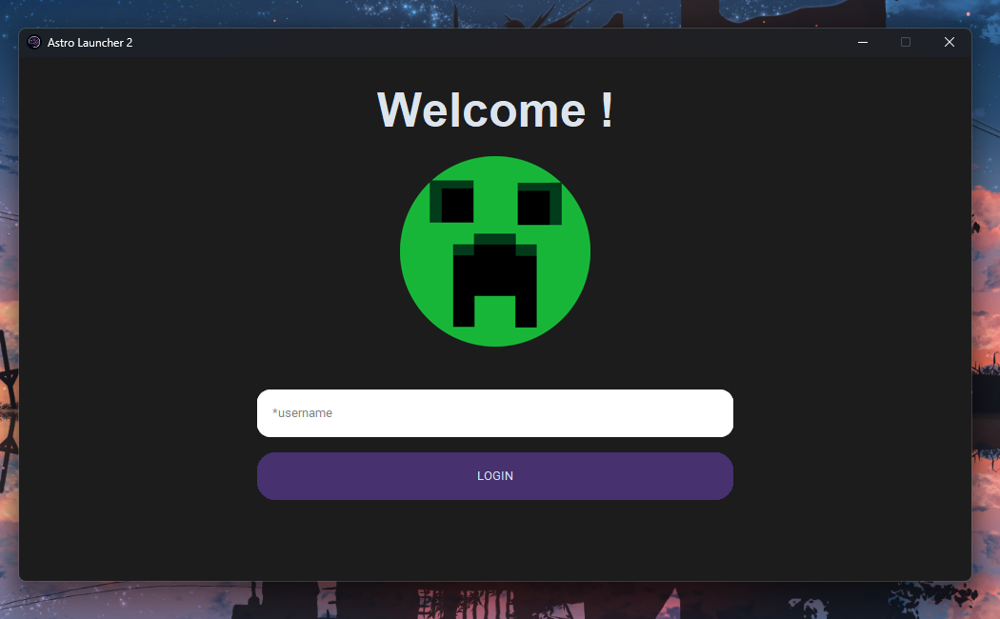
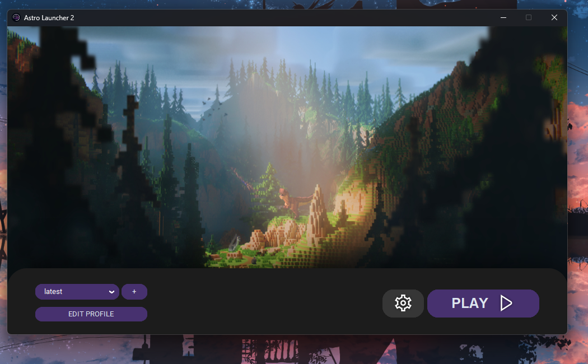
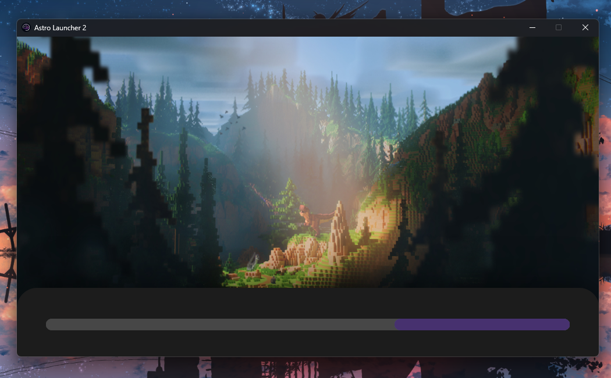
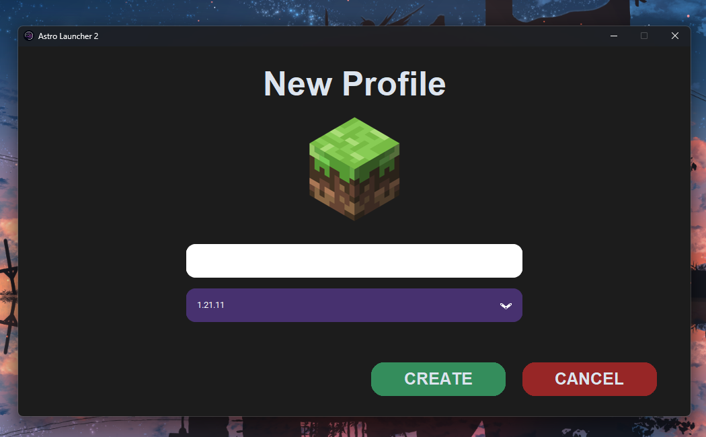
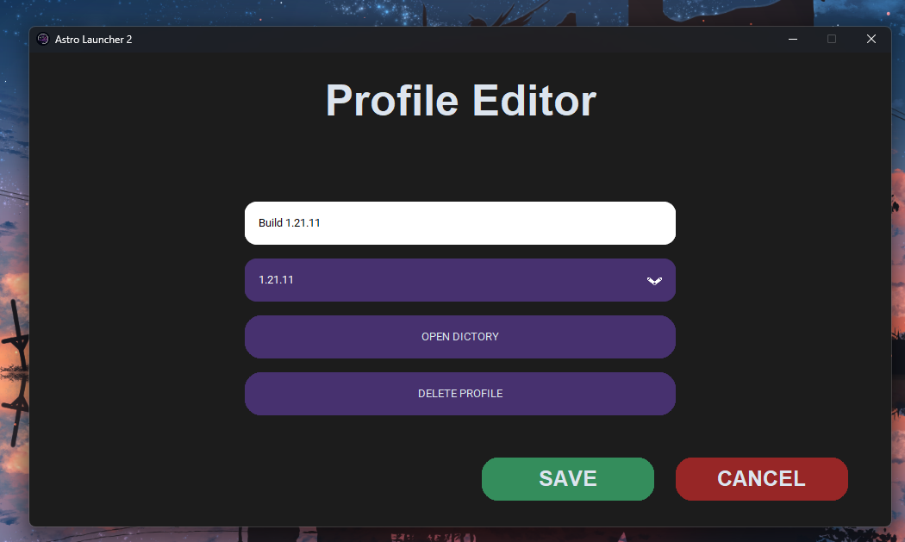

## ♦️ Astro Launcher 2

  
  

## Overview
A minecraft launcher written in python. It can run any version of the game, whether vanilla or modded.
The software is made to separate profiles made by the player. To make it simple, when you want to launch the game, you first need to create a profile with a name and a version. When this is done, you can launch it and all files will be isolated from your others profiles. If you use different texture packs or mods in different versions, every world is only accessible from the profile you used to create it.

### Features

| Feature | Implementation |
| :--- | :--- |
| **GUI** | ✅ |
| **Profiles** | ✅ |
| **Offline Login** | ✅ |
| **Customizable settings** | ✅ |
| **Discord Rich Presence** | ✅ |

### Login page
</img>
### Main Page
</img>
### Loading animation
</img>
### Settings page
</img>
### Profile Managment pages
</img>
</img>

## ⚙️ Installation
To execute this app, you only need to download the last release in the dedicated section, next, extract the zip file and create a shortcut were you want the "AstroLauncher 2.exe" file to be.

## 🚀 Usage
Once your shortcut is placed in the place you want, you can launch it and enjoy !
